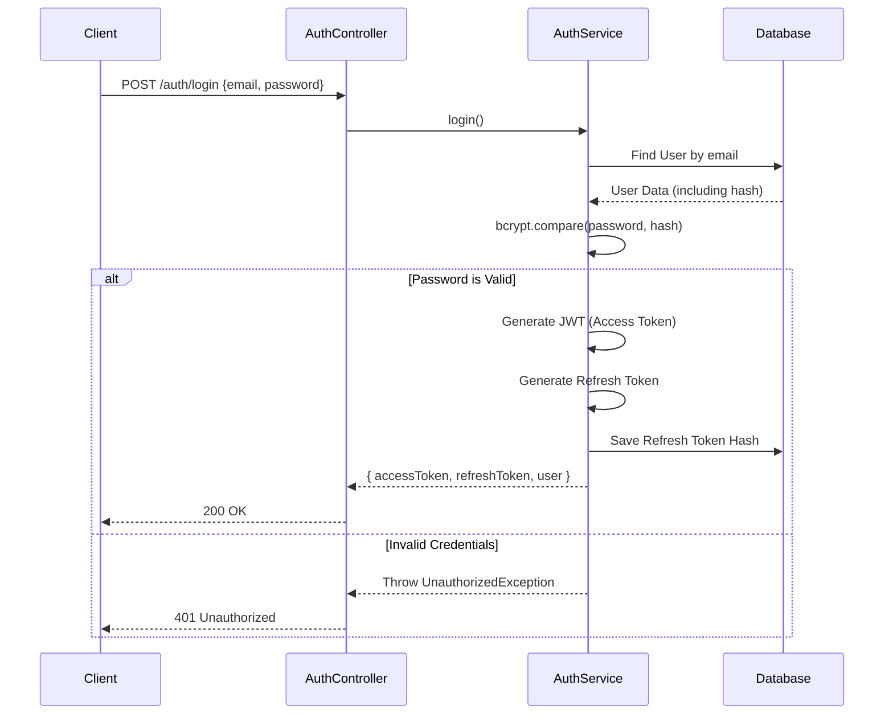

# Auth Module

## اسم الخاصية
نظام المصادقة وإدارة المستخدمين (Authentication & User Management).

## الشرح
يعتبر هذا الـ Module النواة الأساسية للنظام. يقوم بإدارة تسجيل المستخدمين الجدد (عملاء أو مزودي خدمة)، تسجيل الدخول، إصدار وتجديد الـ JWT Tokens، وإدارة الجلسات (Sessions). كما يوفر البنية التحتية لحماية باقي الـ Endpoints في النظام من خلال التحقق من الصلاحيات والـ Roles.

## الارتباطات والاعتماديات
- **لا يعتمد على أي Module آخر** في النظام (مستقل تماماً).
- جميع الـ Modules الأخرى في النظام (`providers`, `jobs`, `messaging`, `reviews`, `verification`) تعتمد عليه بشكل أساسي لاستخراج الـ `User` الحالي والتحقق من هويته عبر الـ JWT.

## طريقة التنفيذ (Implementation)
تم بناء الخاصية باستخدام:
1. **NestJS Passport & JWT:** لإصدار الـ Access Tokens والـ Refresh Tokens وتوقيعها.
2. **Bcrypt:** لتشفير كلمات المرور (Password Hashing) قبل حفظها في قاعدة البيانات.
3. **Custom Repository (`UserRepository` & `RefreshTokenRepository`):** للتعامل مع بيانات المستخدم وجلسات الدخول في الـ Database بعيداً عن الـ Service لضمان فصل المسؤوليات (Separation of Concerns).
4. **Guards & Decorators (`JwtAuthGuard`, `RolesGuard`, `@CurrentUser`):** موجودة في مجلد `shared/` لاستخدامها في حماية أي Endpoint يتطلب مصادقة.

## Endpoints

| Method | Path | Authentication | Description |
|---|---|---|---|
| `POST` | `/auth/register` | Public | Creates a customer or provider account. The public endpoint cannot create admins. |
| `POST` | `/auth/login` | Public | Authenticates an account and returns an access/refresh token pair. |
| `POST` | `/auth/refresh` | Public | Rotates a valid refresh token and returns a new pair. |
| `POST` | `/auth/logout` | Bearer access token | Revokes every active refresh-token session for the current user. |

Successful API responses are wrapped by the global response interceptor. For example:

```json
{
  "success": true,
  "data": {
    "accessToken": "<jwt>",
    "refreshToken": "<token-id>.<secret>",
    "user": {
      "id": "<uuid>",
      "email": "user@example.com",
      "firstName": "Ahmed",
      "lastName": "Ali",
      "role": "customer"
    }
  }
}
```

## Token handling

- Access tokens are signed JWTs and use `JWT_ACCESS_EXPIRATION` (default: `15m`).
- Refresh tokens are opaque values. Only the secret's bcrypt hash is stored in
  `refresh_tokens`; the database never contains a reusable raw token.
- Calling `/auth/refresh` revokes the supplied refresh-token record before a
  new pair is created (rotation). `JWT_REFRESH_EXPIRATION` accepts `s`, `m`,
  `h`, or `d` suffixes, such as `7d`.

## Flow Chart


