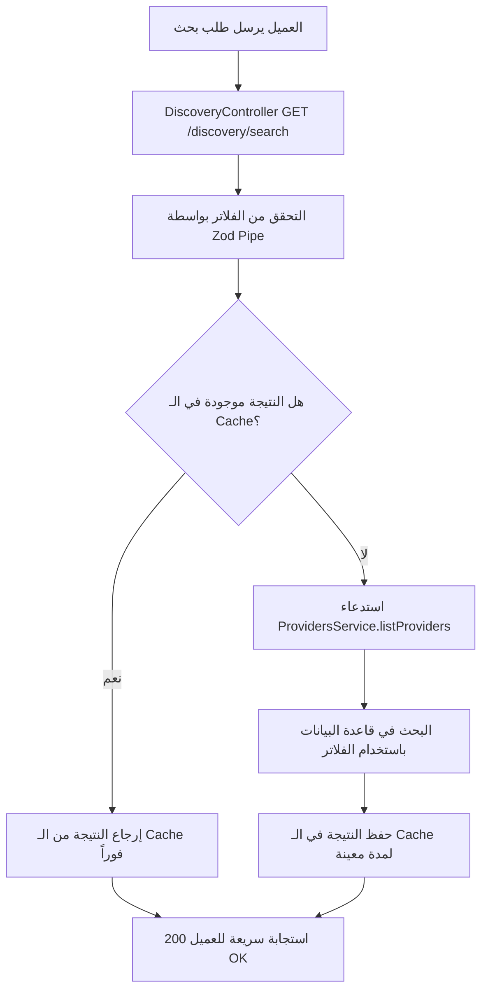

# Discovery Module

## اسم الخاصية
الاستكشاف والبحث (Discovery & Search).

## الشرح
يوفر هذا الـ Module محرك البحث الأساسي في المنصة للعملاء للعثور على مزودي الخدمات المناسبين. يدعم فلاتر متعددة مثل التقييم (Rating)، السعر بالساعة (Price)، التخصص (Category)، والمدينة. هذا الـ Module مصمم ليكون سريعاً وقابلاً للتوسع ليدعم مستقبلاً البحث الجغرافي (Geospatial Search) باستخدام تقنيات مثل Redis للـ Caching أو PostGIS.

## الارتباطات والاعتماديات
- **Providers Module:** يعتمد عليه لجلب قائمة مزودي الخدمة وتطبيق الفلاتر عليها (عبر استدعاء `ProvidersService`).

## طريقة التنفيذ (Implementation)
1. **الـ Service Layer:** `DiscoveryService` لا يملك قاعدة بيانات خاصة به (No Entities)، بل يقوم بعمل تكامل مع `ProvidersService` لجلب البيانات، ويقوم بتطبيق طبقة من الـ Caching على نتائج البحث.
2. **الـ Cache:** استخدام `@nestjs/cache-manager` مع Redis (أو Memory Cache) لتقليل الحمل على قاعدة البيانات في عمليات البحث المتكررة.
3. **Zod Validation:** الـ Search Query يتم التحقق منه باستخدام `searchQuerySchema` للتأكد من أن معايير البحث مثل `minRating` أو `maxPrice` ضمن النطاق المقبول.

## Flow Chart

