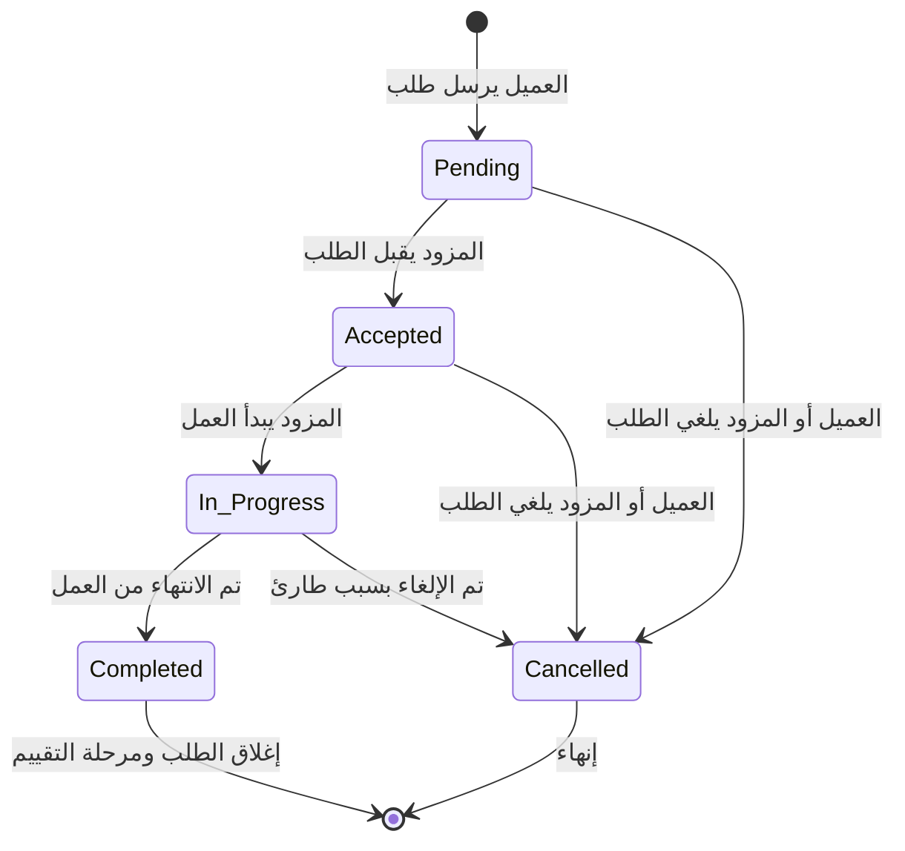

# Jobs Module

## اسم الخاصية
إدارة طلبات الخدمة والوظائف (Service Requests / Jobs Management).

## الشرح
يعتبر هذا الـ Module قلب العمليات التجارية في المنصة. يقوم بإدارة عملية طلب العميل لخدمة من مزود معين. يتولى الـ Module إدارة "دورة حياة الطلب" (State Machine) من البداية حتى النهاية، مع التحقق من صلاحية كل خطوة (مثلاً: لا يمكن إنهاء طلب قبل أن يتم قبوله).

## الارتباطات والاعتماديات
- **Auth Module:** لتحديد هوية العميل.
- **Providers Module:** لربط الطلب بمزود الخدمة (عبر الـ ProviderProfile ID).

## طريقة التنفيذ (Implementation)
1. **الكيان (Entity):** `ServiceRequest` ويربط بين `User` (Customer) و `ProviderProfile` (Provider).
2. **المنطق (Business Logic):** `JobsService` يحتوي على مصفوفة التحولات المسموحة `VALID_STATUS_TRANSITIONS` لضمان عدم حدوث تغييرات غير منطقية في حالة الطلب.
3. **Roles-Based Validation:** يضمن أن المسموح لهم بتحديث حالة الطلب هم فقط العميل أو مزود الخدمة المعنيين بالطلب، أو الأدمن.

## Flow Chart

