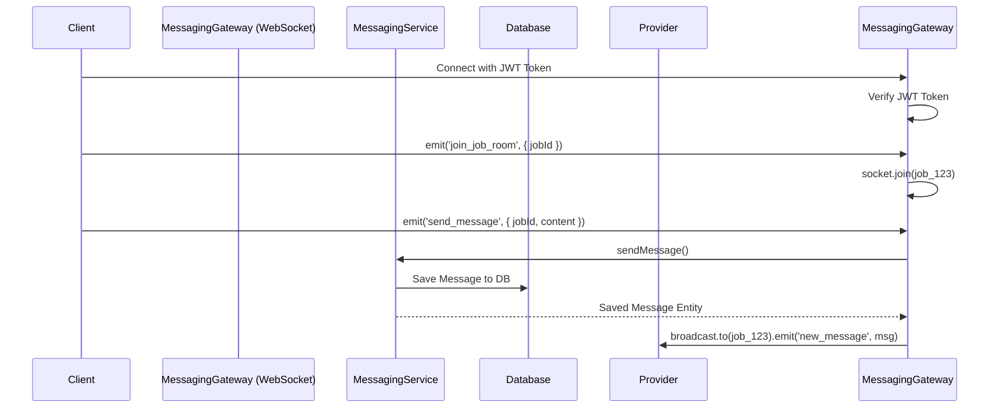

# Messaging Module

## اسم الخاصية
نظام المراسلة الفورية (Real-time Messaging).

## الشرح
يوفر هذا الـ Module وسيلة تواصل لحظية (Real-time) بين العميل ومزود الخدمة. يتم التواصل بخصوص طلب خدمة معين، مما يضمن بقاء جميع الاتصالات مسجلة ومرتبطة بـ Job ID محدد.

## الارتباطات والاعتماديات
- **Auth Module:** لتحديد هوية المرسل (عن طريق استخراج بيانات المستخدم من الـ JWT في مرحلة الاتصال).
- **Jobs Module:** كل رسالة ترتبط بـ `ServiceRequest` معين (`jobId`). لا يمكن إرسال رسائل بدون وجود طلب مسبق.

## طريقة التنفيذ (Implementation)
1. **WebSockets (Socket.IO):** تم استخدام `@nestjs/websockets` وإنشاء `MessagingGateway` للتعامل مع الاتصالات اللحظية بدلاً من الـ REST API.
2. **المصادقة اللحظية:** عند اتصال العميل بالـ Socket، يتم إرسال توكن الـ JWT في الـ Handshake، ويتم فكه والتحقق منه قبل إتمام الاتصال.
3. **الغرف (Rooms):** بمجرد الاتصال، ينضم المستخدم إلى غرفة (Room) تحمل اسم الـ Job ID (`job_${jobId}`). مما يسهل عملية الـ Broadcasting للرسائل الخاصة بهذا الطلب فقط.
4. **حفظ الرسائل:** بالإضافة للـ Broadcasting، يتم حفظ كل رسالة مرسلة في قاعدة البيانات باستخدام `MessageRepository` لضمان وجود أرشيف للمحادثة يمكن استرجاعه لاحقاً عبر الـ REST API في `MessagingController`.

## Flow Chart

