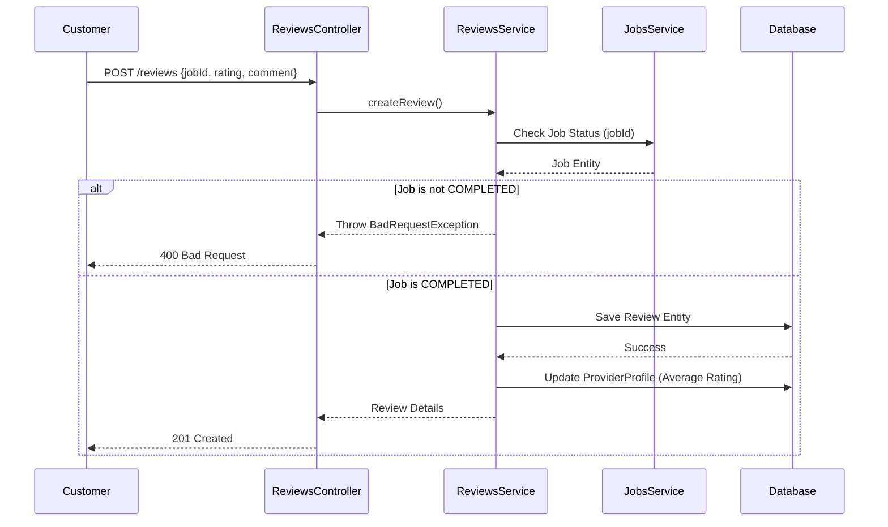

# Reviews Module

## اسم الخاصية
التقييمات والمراجعات (Ratings & Reviews).

## الشرح
يسمح هذا الـ Module للعميل بترك تقييم ومراجعة مكتوبة لمزود الخدمة بعد انتهاء الطلب. هذه التقييمات تظهر في الملف الشخصي لمزود الخدمة وتؤثر على ترتيبه في نتائج البحث (Discovery Module).

## الارتباطات والاعتماديات
- **Auth Module:** لتحديد العميل الذي يقوم بإنشاء التقييم.
- **Providers Module:** لربط التقييم بالمزود.
- **Jobs Module:** يعتمد عليه للتحقق من أن الطلب (`ServiceRequest`) انتهى فعلياً (Completed) قبل السماح بالتقييم.

## طريقة التنفيذ (Implementation)
1. **Entity:** `Review` Entity يرتبط بالـ `User` (صاحب التقييم)، الـ `ProviderProfile` (المُقيَّم)، والـ `ServiceRequest` (الطلب المرتبط).
2. **Repository:** `ReviewRepository` لإدارة عمليات إدخال التقييم وحساب متوسط التقييمات لمزود معين.
3. **التحقق (Validation):**
   - العميل لا يمكنه تقييم طلب لم يكتمل (`COMPLETED`).
   - العميل لا يمكنه ترك أكثر من تقييم لنفس الطلب.
   - يتم التقييم بـ Rating من 1 إلى 5.

## Flow Chart

