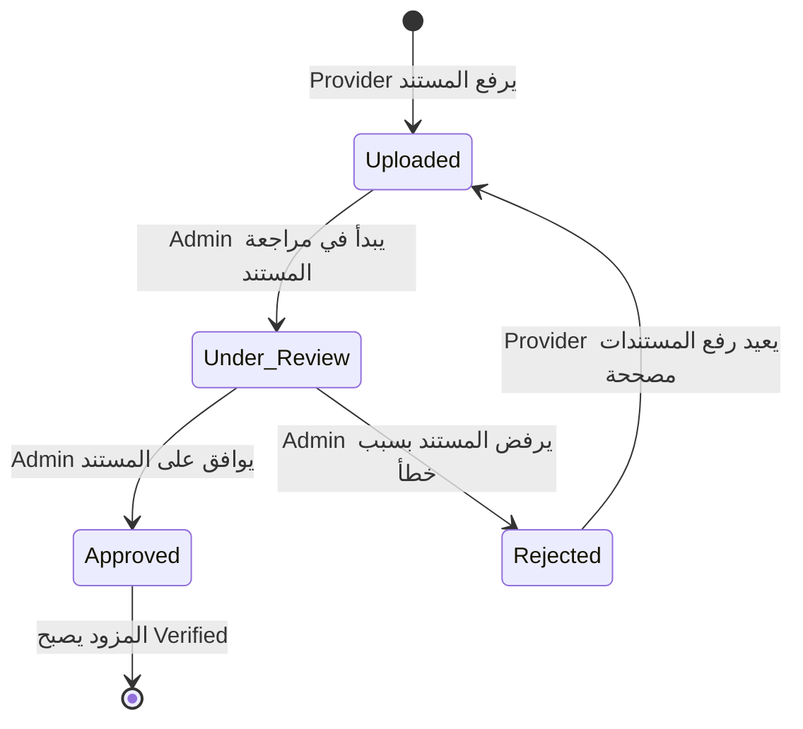

# Verification Module

## اسم الخاصية
توثيق هويات مقدمي الخدمة (Provider Identity Verification).

## الشرح
نظام مصمم لضمان جودة وأمان المنصة من خلال توثيق هويات مزودي الخدمة. يمكن للمزودين رفع مستنداتهم الثبوتية (هوية، جواز سفر، شهادات مهنية)، وبالمقابل يمتلك مدراء النظام (Admins) لوحة تحكم لمراجعة هذه المستندات والموافقة عليها أو رفضها، مما يمنح المزود شارة "موثق" (Verified).

## الارتباطات والاعتماديات
- **Providers Module:** المستندات المرفوعة ترتبط بملف مزود الخدمة (ProviderProfile).
- **Auth Module:** لتحديد هوية مزود الخدمة الذي يرفع المستندات، والتحقق من صلاحية "المدير" (`UserRole.ADMIN`) للشخص الذي يراجعها.

## طريقة التنفيذ (Implementation)
1. **Entity:** `VerificationDocument` يحفظ تفاصيل المستند المرفوع ويرتبط بـ `User` و `ProviderProfile`.
2. **Roles & Guards:** تم حماية الـ Endpoints باستخدام `@Roles(UserRole.ADMIN)` لضمان أن الإداريين فقط هم من يستطيعون عرض وتحديث حالة التوثيق.
3. **الفصل بين الرفع والمراجعة:** 
   - `POST /verification/documents` لرفع مستند جديد (مخصص للمزودين).
   - `PATCH /verification/:id/review` لتحديث حالة المستند إلى "Approved" أو "Rejected" (مخصص للإداريين).

## Flow Chart

